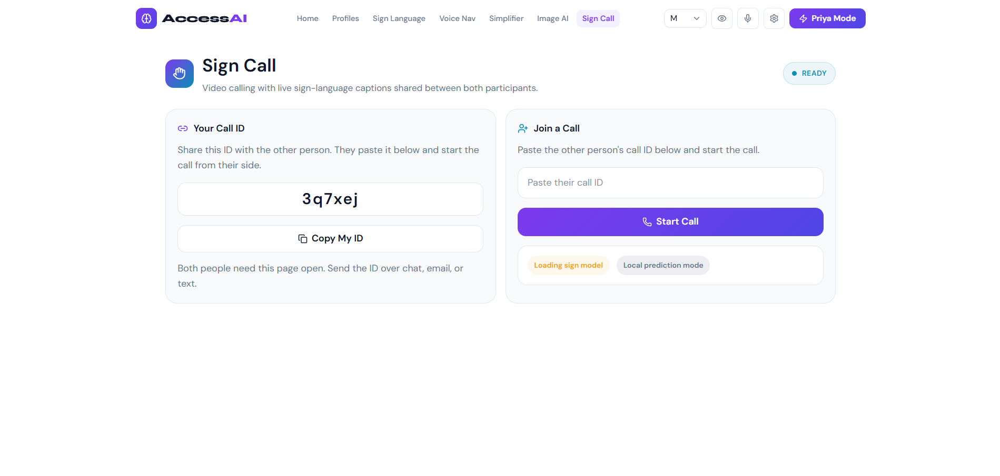
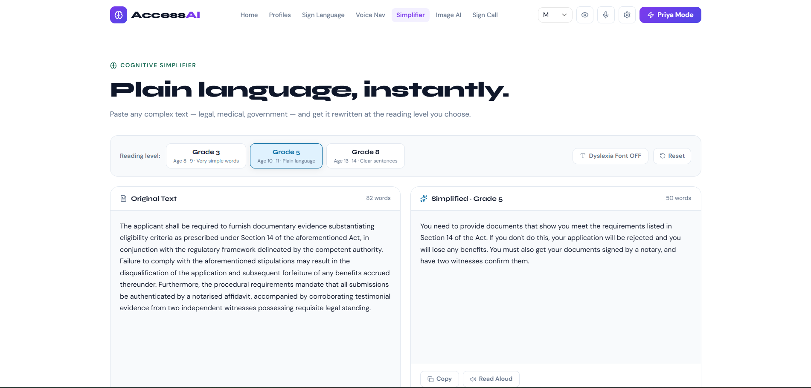
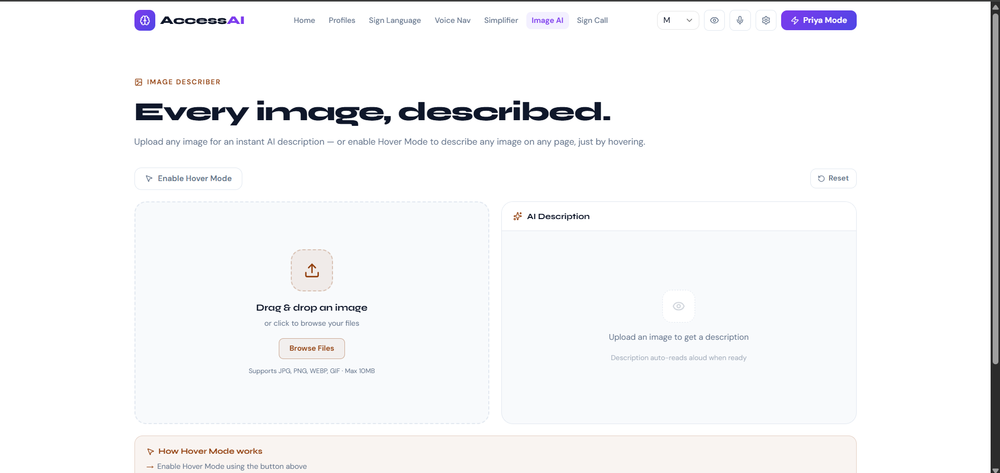
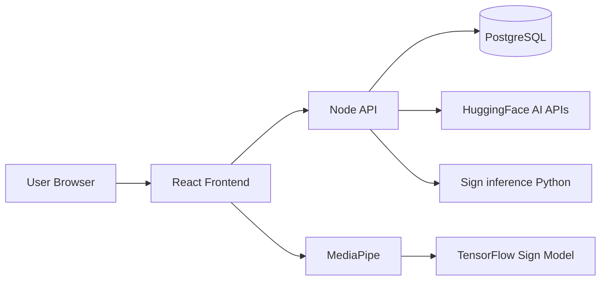

# 🚀 AccessAI

**AI-Powered Accessibility Platform**

[](#license)
[](https://nodejs.org/)
[](https://react.dev/)
[](https://www.python.org/)
[](https://www.postgresql.org/)

AccessAI is an **AI-powered accessibility platform** designed to make websites easier to use for people with disabilities.

It combines **computer vision, speech processing, and natural language AI** to help users interact with digital content more easily.

RUN : pnpm run dev:win

---

# 🎥 Demo

Watch the project demo:

[](https://youtu.be/K3-UwKsswkE)

---

# 📸 Screenshots

### Home Page


### Sign Language Detection



### Text Simplifier



### Image Describer



---

# 🌍 Why AccessAI?

Over **1.3 billion people globally live with disabilities**, yet many websites are not accessible.

AccessAI provides AI-driven tools that help users:

* Understand complex content
* Navigate websites using voice
* Interpret sign language
* Understand images through AI descriptions

Our goal is to build a **more inclusive internet**.

---

# ✨ Features

## 🤟 Sign Language Recognition

Real-time sign language detection using webcam input.

* Hand landmark detection via **MediaPipe**
* Gesture recognition with **TensorFlow**
* Converts sign language → text → speech

---

## 🧠 Cognitive Text Simplifier

Simplifies complex text into easy-to-read language.

Example:

Original
"The government implemented a comprehensive environmental sustainability initiative."

Simplified
"The government started a plan to protect the environment."

Helps users with:

* Dyslexia
* Cognitive disabilities
* Low literacy levels

---

## 🖼 Image Description

Automatically generates descriptions for images.

Example output:

"A person in a wheelchair working on a laptop."

Helps visually impaired users understand visual content.

---

## 🎙 Voice Navigation

Users can control the interface using voice commands.

Example commands:

* scroll down
* go back
* read page
* increase text

Designed for users with **motor disabilities**.

---

# 🏗 System Architecture



---

# ⚙️ Tech Stack

### Frontend

* React
* Vite
* TailwindCSS

### API

* Node.js (Fastify + Prisma) — `server/`
* WebSockets

### Sign ML (internal service)

* Python + TensorFlow — `services/sign-inference/`

### AI / Machine Learning

* TensorFlow / MediaPipe (browser + sign service)
* Hugging Face (text, vision, voice)

### Database

* PostgreSQL

---

# 📂 Project Structure

```
accessai
│
├── server
│   ├── src
│   └── prisma
│
├── services/sign-inference
│   └── app
│
├── frontend
│   ├── src
│   │   ├── components
│   │   ├── pages
│   │   ├── api
│   │   └── context
│
└── docs
```

---

# 🚀 Getting Started

## Clone Repository

```bash
git clone https://github.com/Kiran-Shetty-afk/accessai.git
cd accessai
```

---

## Full stack (Node API + sign + frontend + Postgres)

From the repo root, with [pnpm](https://pnpm.io/) and a Python venv in `services/sign-inference/.venv` (see `brain/02-local-dev.md`):

```bash
pnpm install
pnpm --dir server exec prisma generate   # first time only
pnpm dev
```

This runs **Docker Postgres** (if Docker is running), **sign-inference** on port 9001, the **Node API** in `server/` (port from `server/.env`, usually 8001), and the **Vite** dev server. Stop child processes with Ctrl+C.

**All-in-Docker API** (Postgres + sign-inference + Node in Compose; Vite on the host): `pnpm dev:docker` — see `deploy/README.md`.

---

# 🔧 API (Node) setup

See **`server/README.md`** for Prisma, env vars, and routes. Quick start:

```bash
cd server
pnpm install
pnpm exec prisma generate
pnpm run db:migrate:dev   # or migrate deploy
pnpm dev
```

Default URL: **`http://localhost:8001`** (set `PORT` in `server/.env`).

---

# 💻 Frontend Setup

```
cd frontend
pnpm install
pnpm dev
```

Frontend runs at

```
http://localhost:5173
```

---

# 🧪 Testing

API unit tests (from `server/`):

```bash
cd server && pnpm test
```

Manual check: **`GET http://localhost:8001/health`**

---

# 🔗 Example API

POST `/api/simplify`

Request:

```json
{
"text": "The government implemented a comprehensive environmental sustainability initiative.",
"grade_level": 5
}
```

Response:

```json
{
"simplified": "The government started a plan to protect the environment.",
"word_count_before": 9,
"word_count_after": 8,
"cached": false
}
```

---

# 📈 Future Improvements

* Multi-language accessibility support
* Larger sign language dataset
* Browser extension improvements
* Mobile support
* Real-time translation

---

# 🤝 Contributing

Contributions are welcome!

1. Fork the repository
2. Create a new branch
3. Commit changes
4. Submit a Pull Request

---

# ❤️ Vision

Technology should empower everyone, regardless of ability.

AccessAI aims to build a **more inclusive internet** using AI.
